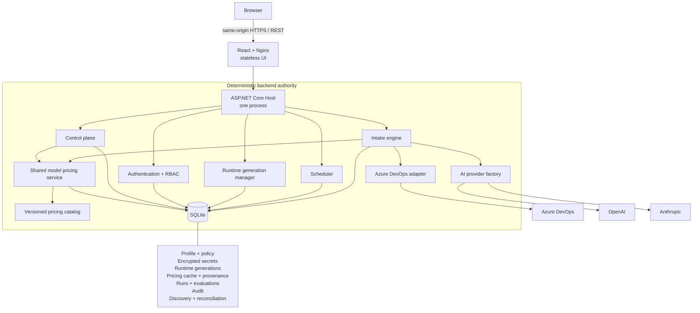

# Engineering Intake Gate

Engineering Intake Gate is a self-hosted engineering intake quality-control platform. It evaluates Azure DevOps work items against configurable intake standards before Engineering begins investigation, combining deterministic governance with structured AI-assisted assessment.

**Current release:** `2026.9.4` (Controlled Dry Run MVP). It shows exactly what feedback and intake-state changes would be proposed, but it cannot enable Production or modify Azure DevOps.

## Why this exists

Support and defect escalations often arrive without reproducible steps, customer or environment context, expected-versus-actual behavior, troubleshooting already performed, business impact, evidence, or regression context. Engineering then pays for the gap through clarification loops, queue latency, interruptions, inconsistent intake quality, and unreliable prioritization signals.

Engineering Intake Gate applies one explicit, repeatable quality gate before investigation begins. It does not decide whether a report is true or important; it decides whether the intake contains enough relevant evidence and context to start investigating without avoidable clarification.

## What it does

- Executes one governed Azure DevOps saved query and evaluates eligible work items.
- Combines deterministic eligibility, evidence normalization, secret redaction, validation, and decision handling with structured AI assessment.
- Supports OpenAI and Anthropic, including credential verification, model discovery, manual model-ID fallback, and backend-owned estimated pricing for confirmed models.
- Presents four distinct outcomes: **Engineering Ready**, **Intake Incomplete**, **Error**, and **Not Eligible**.
- Supports manual single-ticket analysis, **Run Profile Now**, and Manual/Hourly/Daily/Weekly/Custom schedules.
- Keeps manual analysis inside the configured saved-query and exclusion boundary.
- Shows proposed Azure DevOps tag/comment effects separately from confirmed actual effects.
- Suppresses duplicate updates when a materially unchanged assessment is safely proven.
- Provides Home metrics, run history, run detail, evaluation detail, System Health, and actor-aware Audit views.
- Records per-request provider/model usage and persisted USD estimated AI cost, including retry, partial, and unavailable-cost semantics.
- Persists a bounded, redacted Analysis Context and attachment-evidence cache for 30 days by default, with smart rerun and explicit Force Fresh Analysis.
- Produces a structured ticket summary for both Engineering Ready and Intake Incomplete and previews the exact planned Azure DevOps comment/tag delta.
- Enforces local Admin/Viewer RBAC, cookie sessions, CSRF protection, encrypted local credentials, and environment-variable credential references.
- Activates append-only configuration generations so an active run cannot change underneath itself.
- Resumes the first-run setup wizard from backend-persisted state after browser or container restarts.

## Product tour

| Setup and governance | Daily operations |
|---|---|
| [](docs/PRODUCT_TOUR.md#ai-provider-and-model) | [](docs/PRODUCT_TOUR.md#home) |
| [](docs/PRODUCT_TOUR.md#saved-query-preview) | [](docs/PRODUCT_TOUR.md#run-detail) |
| [](docs/PRODUCT_TOUR.md#review-and-finish) | [Evaluation detail: Analysis Context, reuse, and exact Dry Run preview](docs/PRODUCT_TOUR.md#evaluation-detail) |

See the [full Product Tour](docs/PRODUCT_TOUR.md) for all major screens, controls, workflows, and safety behavior.

## A real-world example

Suppose a ticket says only:

> Customer upload fails. Please investigate.

The gate may determine that the intake lacks customer/environment context, the exact error, reproduction steps, expected behavior, prior investigation, business impact, and regression information.

```text
Intake Incomplete

Missing:
- Reproduction steps
- Expected behavior
- Support investigation
- Business impact

Controlled Dry Run:
- Proposed Azure DevOps feedback is visible
- No Azure DevOps mutation is performed
```

A stronger report might include a synthetic staging environment, exact steps, an observed `504`, the expected response, timestamps and correlation IDs, a comparison with the prior release, troubleshooting already completed, and quantified impact. That report can be **Engineering Ready**.

**Engineering Ready means enough information exists to start engineering investigation.** It does not confirm a product defect, root cause, ownership, severity, priority, solution, fix approval, commitment, or customer claim.

## Core workflows

1. **First-time setup** — bootstrap the initial Admin, configure Azure DevOps and one AI provider, define the intake policy, confirm the saved query, choose a schedule, and finish in Controlled Dry Run.
2. **Analyze one ticket** — enter a positive work-item ID or a work-item URL from the configured organization/project. The backend rechecks saved-query membership and exclusions before AI is allowed to run.
3. **Run Profile Now** — execute the configured saved query immediately through the same lease, discovery, evaluation, and audit path used by the scheduler.
4. **Automatic evaluation** — the in-process scheduler uses the active immutable generation, configured `TimeZoneInfo` timezone, and Cronos schedule. Manual Only creates no automatic executions.
5. **Review results** — inspect the structured ticket summary, Analysis Context, attachment processing/reuse, criteria, exact ADO preview, token usage, and current-run cost.
6. **Diagnose integrations** — review persisted state in System Health and explicitly test Azure DevOps or the selected AI provider as an Admin.
7. **Audit changes** — filter safe, actor-aware configuration, credential, user, and execution-request events.

## Architecture

The UI is a stateless React application served by Nginx. The browser talks only to the same-origin ASP.NET Core REST API; all provider access and product authority remain in the backend.



Important boundaries:

- SQLite is the sole profile/policy authority after setup or explicit one-time legacy import.
- A deployment has zero or one logical profile and one saved-query boundary.
- Every run captures one immutable validated configuration generation and exact credential revisions.
- The backend remains headless-capable; the UI adds no engine or provider logic.
- Domain and Application projects are independent of ASP.NET HTTP, Azure DevOps, OpenAI, Anthropic, and provider SDK types.

See [Architecture](docs/ARCHITECTURE.md) and the [UI/control-plane ADR](docs/adr/0002-ui-control-plane-contract.md).

## Safety model

- **Controlled Dry Run first:** Production (`LIVE`) is rejected by current management and activation paths.
- **Saved-query governance:** both scheduled/profile runs and manual ticket analysis are bounded by the confirmed saved query; configured exclusions remain authoritative.
- **Audit before write:** the existing narrow mutation pipeline persists trusted evaluation and proposed effects before any authorized external write path.
- **Immutable run snapshots:** configuration and credential replacement affects future runs, never an active run.
- **No guessed success:** invalid or contradictory AI output, stale revisions, provider failures, unsafe persistence, or unresolved mutation state cannot become Engineering Ready or trigger enforcement.
- **Duplicate suppression and reconciliation:** materially unchanged outcomes avoid redundant updates; durable reconciliation resolves partial/uncertain narrow effects without blindly replaying AI output.
- **No overlapping runs:** a refreshable SQLite profile lease serializes scheduled, Run Profile Now, and manual ticket executions.
- **Protected secrets:** local values use AES-256-GCM with separate installation key material; credentials are replaceable but never redisplayed.
- **Server authorization:** Admin/Viewer RBAC and antiforgery checks are enforced by the backend, not merely hidden in the UI.

## Technology stack

- **Backend:** .NET 10, ASP.NET Core, C#
- **Frontend:** React 19, TypeScript 5.9, Vite 8, Material UI 9, React Router 7
- **Persistence:** SQLite via `Microsoft.Data.Sqlite`
- **Scheduling:** Cronos and `TimeZoneInfo`
- **AI:** OpenAI and Anthropic REST adapters
- **Content processing:** AngleSharp, PdfPig, ImageSharp
- **Infrastructure:** Docker, Docker Compose, Nginx
- **Testing:** xUnit, Vitest, React Testing Library, `vitest-axe`, deterministic fakes/mocks

## Prerequisites

### Normal Docker use

- Git
- Docker Desktop, or Docker Engine with Docker Compose v2
- A modern browser
- Network access for the first build to pull container images and packages

**You do not need the .NET SDK or Node.js installed locally when running the application through Docker.**

The supplied deployment serves plain HTTP on loopback for local evaluation. For any network-accessible deployment, place it behind a trusted HTTPS/TLS edge and preserve `X-Forwarded-Proto`.

### Local development

- .NET SDK `10.0.301` (or a compatible .NET 10 feature band; see `global.json`)
- Node.js `24.21.0` and npm (see `.node-version`)
- Docker with Docker Compose v2 for the integration/product harnesses
- `curl` and a POSIX shell for the release harness

## Quick start

Clone the future public repository URL after the owner creates it:

```bash
git clone https://github.com/<your-github-username>/engineering-intake-gate.git
cd engineering-intake-gate
docker compose up -d --build
```

Open [http://127.0.0.1:8080](http://127.0.0.1:8080).

Follow container logs when troubleshooting startup or onboarding:

```bash
docker compose logs -f
```

1. Create the one-time Bootstrap Admin.
2. Follow the setup wizard.
3. Configure Azure DevOps and verify a read-only PAT.
4. Configure OpenAI or Anthropic, verify the key, and confirm a model.
5. Define the profile and intake policy.
6. Validate, preview, and confirm the saved query.
7. Select Manual Only or a schedule.
8. Review and finish.
9. Operate in Controlled Dry Run.

Stop the application without deleting its durable named volume:

```bash
docker compose down
```

> **Destructive:** adding `--volumes` (or `-v`) deletes the Compose-managed application volume, including the database, credential-encryption key, and Data Protection keys. Back up the required artifacts first.

Set `INTAKE_GATE_PORT` to publish a different local port, for example `INTAKE_GATE_PORT=9080`.

## First-run setup

### 1. Bootstrap Admin

The first request creates exactly one local Administrator. Store this password safely: the MVP has no password-reset or recovery workflow.

### 2. Azure DevOps

Provide:

- the organization URL, such as `https://dev.azure.com/example-organization`;
- the project name;
- a Personal Access Token with **Work Items: Read** for this Controlled Dry Run release.

The adapter executes the saved query and reads work items, comments, relations, and selected attachment content. No Code, Build, Identity, or project-administration scope is required. The dormant, release-gated write adapter would require Work Items read/write, but Production is unavailable and that broader scope is not needed for normal use.

Choose either a locally encrypted PAT or an advanced environment-variable reference. Local ciphertext is stored in SQLite and decrypted with `/app/data/intake-gate.secret-key`; only the environment variable name is stored for reference-based credentials.

### 3. AI provider and model

Choose OpenAI or Anthropic, save an API key locally or as an environment reference, run verification, discover models, and confirm one. If discovery is unavailable, enter a model ID manually and validate it. An already confirmed model is not erased by a later discovery outage.

After confirmation, the backend resolves estimated input, cached-input when applicable, and output pricing from its versioned provider-neutral catalog. Results retain currency, source, catalog version, effective date, and verification time in SQLite. They are fresh for seven days by default (`AiPricing:FreshnessDays`), and **Refresh pricing** bypasses that TTL without deleting the last valid value if refresh fails. Unknown pricing never prevents confirmation or Continue. Pricing is an estimate only; the provider determines actual charges.

The same pricing service now snapshots estimated cost for each billable provider interaction, including retries. Provider-reported model metadata takes precedence over the requested model, with profile configuration used only as a final fallback. A refresh failure uses the last verified price and records that it was stale; missing usage or pricing produces an unavailable or partial estimate without changing the evaluation outcome. Existing completed records are never repriced or backfilled. See [AI model pricing and cost accounting](docs/AI_MODEL_PRICING.md) for catalog scope, precedence, aggregation, and maintenance.

### 4. System defaults and profile/policy

Initialize the server-owned draft, then define versioned criteria and evaluation guidance. Configure distinct Engineering Ready/Intake Incomplete tags, policy URL/version, exclusions, retry/concurrency settings, AI timeout, audit retention, 30-day-default reusable evidence retention, and bounded content/attachment limits. These settings describe intake sufficiency only; they must not encode defect truth, ownership, severity, or priority decisions.

The setup and Profile / Configuration screens can export these portable settings to versioned JSON and import them later. Import is a full replacement after explicit confirmation, not a merge. The JSON contract excludes credentials, generated identifiers, runtime state, and history; incomplete imports remain editable and use the existing Profile & Policy validation guidance.

### 5. Saved query

Enter a query GUID or a query URL from the configured organization/project. The backend resolves and executes it, reports the count, and previews the first 10 items before explicit confirmation. This saved query is the governance boundary for both batch and manual analysis.

### 6. Schedule

Choose Manual Only, Hourly, Daily, Weekly, or Custom. Scheduled executions use a six-field Cronos expression and the selected `TimeZoneInfo` timezone. There is no missed-run catch-up and the existing lease prevents overlap.

### 7. Review and finish

Review backend-owned readiness state and finalize. The initial immutable runtime generation activates without a restart. Execution mode is fixed to Controlled Dry Run.

## Daily usage

### Analyze Ticket

Sign in as an Admin, open **Analyze Ticket**, enter a positive work-item ID or supported full Azure DevOps work-item URL, and submit. If the item is outside the saved query or matches an exclusion, the result is **Not Eligible** and AI is not invoked. Eligible results open the persisted run record.

### Run Profile Now

Open **Runs** and select **Run Profile Now**. The synchronous request executes the saved query through the same discovery, lease, evaluation, and audit workflow used by scheduled runs. No second run is queued while the profile lease is active.

### Scheduled runs

When enabled, the in-process scheduler evaluates future occurrences from the active configuration generation. System Health shows whether scheduling is Manual Only, waiting, scheduled, or blocked by activation failure.

### Reviewing results

- **Engineering Ready:** sufficient evidence/context to begin investigation.
- **Intake Incomplete:** specific relevant intake information is missing or ambiguous.
- **Error:** a technical, provider, validation, or persistence failure; never treated as Intake Incomplete.
- **Not Eligible:** outside the confirmed query boundary or excluded by policy; excluded from readiness metrics.

Run and evaluation views show proposed effects independently from confirmed actual effects. Evaluation detail shows the exact persisted comment/tag plan, structured PASS/FAIL summary, Analysis Context, attachment reuse, and evaluation reuse. In this Controlled Dry Run release, actual effects remain empty.

Use **Rerun** to reuse every valid artifact and skip the provider entirely when nothing relevant changed. Use **Force Fresh Analysis** only when fresh processing is needed; its confirmation notes that it can incur new AI cost. Both paths remain Dry Run and create a new audit. See [Analysis Context, evidence retention, and smart rerun](docs/ANALYSIS_CONTEXT_AND_REUSE.md).

Estimated AI cost is a persisted USD estimate, not provider-billed cost. Every provider interaction with usage and known pricing contributes input and output token cost; retries therefore count. Evaluation cost is the sum of its provider interactions, run cost is the sum of its evaluations, and Home aggregates those persisted evaluation estimates once within the selected 7/30/90-day window. `—` means unavailable, not zero. Partial estimates show the known amount with concise coverage text, while a true known zero is `$0.00 USD`.

Duplicate update suppression is recorded only when persisted state proves that an assessment is materially unchanged. Repeated Dry Run predictions are not mislabeled as actual suppressed writes.

## Operations and troubleshooting

- **Home** — bounded 7/30/90-day readiness and operational summary plus recent runs and health warnings.
- **Runs** — paged/filterable execution history and drill-down.
- **System Health** — application, database, setup, runtime generation, scheduler, and persisted integration state. Opening it does not call providers.
- **Audit** — safe, paged, actor-aware control-plane history with bounded filters.

Common checks:

- **Azure DevOps authentication failure:** System Health → **Test Azure DevOps**; then verify organization/project and replace or correct the PAT source.
- **AI failure:** inspect System Health, verify the selected provider credential, and revalidate the configured model.
- **Setup incomplete:** sign in as an Admin and resume **Setup**; progress is restored from SQLite.
- **No scheduled execution:** inspect the Scheduler card for Manual Only, waiting, next occurrence, or activation failure.

Follow container logs for advanced diagnosis:

```bash
docker compose logs -f
```

There is no in-app persistent logs browser.

## Data, persistence, and backup

Product Compose mounts the logical named volume `intake-gate-product-data` at `/app/data` in the backend container. Docker Compose may prefix the physical volume name with the project name.

Important contents:

- `/app/data/intake-gate.db` — SQLite application/configuration/runtime state
- `/app/data/intake-gate.secret-key` — AES-GCM credential-encryption key
- `/app/data/data-protection-keys/` — ASP.NET Core cookie/session key ring

**A valid restore using locally encrypted credentials requires a consistent SQLite/application-state backup and the matching `intake-gate.secret-key`.** Losing or mismatching the key intentionally makes those credentials undecryptable. Preserve the Data Protection key ring to retain existing sessions; otherwise users must sign in again. The product does not implement automated backups.

The database also contains the model-pricing cache and its source/freshness metadata. Schema 16 adds separate expiring analysis-context, attachment-artifact, reusable-evaluation, and future selected-screenshot tables without rewriting profile, credential, or historical run data. Audit JSON retains provider/cost and reuse provenance; historical records without the additive fields continue to render.

## Security

- Local Admin/Viewer authentication uses ASP.NET Core's adaptive password hasher.
- HttpOnly, SameSite=Strict cookie sessions are bounded and tied to persisted user/password version state.
- All cookie-authenticated mutations require antiforgery validation; RBAC is enforced server-side.
- Local credentials use randomized authenticated AES-256-GCM with a separate 256-bit installation key.
- Credentials, ciphertext, encryption keys, password material, provider payloads, and attachment bytes are excluded from public API/log/audit surfaces. Bounded normalized customer-derived evidence is now deliberately persisted after secret redaction and exposed only through safe operational DTOs.
- Nginx provides a same-origin proxy plus Content Security Policy, frame, referrer, permissions, MIME-sniffing, and opener protections.
- The browser never calls Azure DevOps or AI providers directly and never receives credential values.
- Production activation remains unavailable.

## Testing

Run the canonical release gate:

```bash
./test-harness/test-release-gate.sh
```

It covers backend unit/integration/acceptance tests; SQLite migrations and restart recovery; Product API RBAC/CSRF; OpenAPI/client-contract drift; frontend component, accessibility, type, lint, build, and package audit checks; secret/data leakage; onboarding and runtime execution; Product Compose startup; saved-query governance; and deterministic mock/fake external providers. The default gate never needs live Azure DevOps, OpenAI, or Anthropic credentials.

The root `docker-compose.yml` is always the public product topology. Reproducible test-only Compose files are intentionally tracked under `test-harness/compose/` and are loaded only by explicit harness commands. Developer-specific `docker-compose.override.yml` and `docker-compose.*.local.yml` files are optional and ignored by Git.

## Versioning

Releases use calendar-first, SemVer-compatible `YYYY.M.PATCH` versions. The month is never zero-padded, the monthly patch counter starts at `0`, prereleases use normal SemVer identifiers, and Git tags add a `v` prefix. See [Versioning](docs/VERSIONING.md) for the concise policy.

The current release is `2026.9.4`; its corresponding Git tag is `v2026.9.4` when the owner chooses to create it.

See [CONTRIBUTING.md](CONTRIBUTING.md) for focused development commands.

## Current limitations

These are deliberate first-release boundaries:

- Controlled Dry Run only; Production is unavailable.
- One logical profile and one saved query per deployment.
- Local accounts only; no Entra ID/SSO, MFA, or password recovery.
- No cancel or queue-based execution controls. Normal Rerun and confirmed Force Fresh Analysis are available for a single governed ticket.
- No out-of-query manual analysis.
- No persistent logs UI, notifications, or advanced analytics.
- No automatic backup system.
- No multi-profile routing, selection, cloning, or archival.
- Pricing refresh currently re-resolves the reviewed bundled catalog; no provider pricing endpoint, website scraping, invoice integration, billing reconciliation, account-specific override UI, regional/long-context pricing, cached-token accounting, or historical cost backfill is implemented.

## Engineering highlights

- Immutable configuration generations and active-run snapshot isolation
- Exact credential-revision binding and encrypted secret lifecycle
- Atomic saved-query checkpoint rebaseline
- Deterministic, offline provider doubles and release harness
- Actor-aware audit and full RBAC/CSRF route matrix
- Ordered, restart-safe SQLite migration chain
- Checked OpenAPI-generated TypeScript contracts
- Accessible React routes with automated axe coverage
- Same-origin two-container topology with a single backend authority

## Documentation

- [Product Tour](docs/PRODUCT_TOUR.md)
- [Architecture](docs/ARCHITECTURE.md)
- [ADR 0001 — Single-process MVP](docs/adr/0001-single-process-mvp.md)
- [ADR 0002 — UI and control-plane contract](docs/adr/0002-ui-control-plane-contract.md)
- [Release and safety posture](docs/MVP_RELEASE_GATE.md)
- [Requirements traceability](docs/REQUIREMENTS_TRACEABILITY.md)
- [Engineering rules](docs/ENGINEERING_RULES.md)
- [Versioning](docs/VERSIONING.md)
- [2026.9.4 release notes](docs/RELEASE_NOTES_2026.9.4.md)
- [2026.9.3 release notes](docs/RELEASE_NOTES_2026.9.3.md)
- [2026.9.2 release notes](docs/RELEASE_NOTES_2026.9.2.md)
- [2026.9.1 release notes](docs/RELEASE_NOTES_2026.9.1.md)
- [Development guide](CONTRIBUTING.md)

## License

This project is licensed under the MIT License. See [LICENSE](LICENSE).
