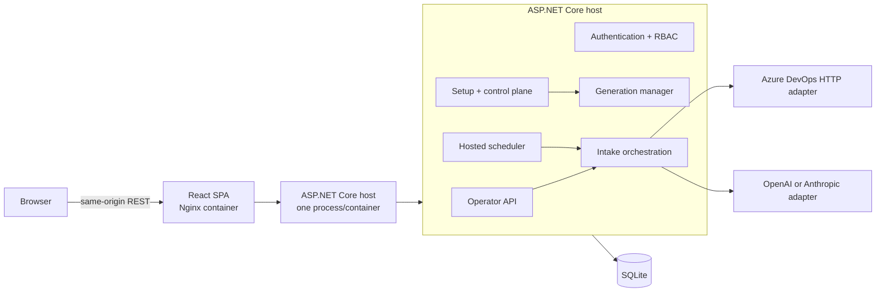
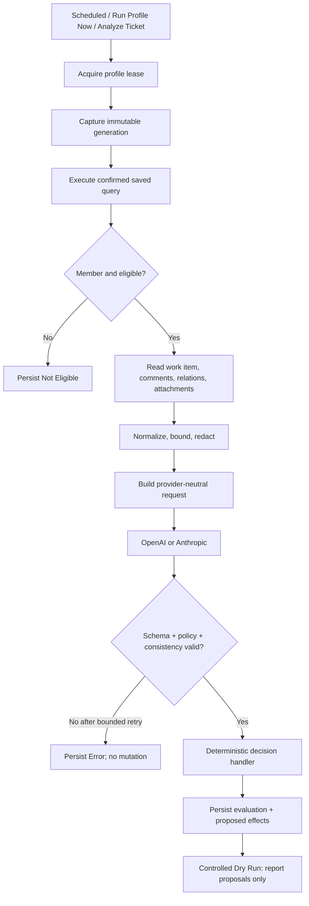

# Engineering Intake Gate Architecture

## Purpose and invariant

Engineering Intake Gate determines whether an Azure DevOps intake contains enough relevant evidence and context for Engineering to begin investigation without avoidable clarification.

`PASS` is presented as **Engineering Ready** and means intake completeness only. It is not a defect finding, ownership decision, severity or priority validation, root-cause statement, solution, commitment, or confirmation of a customer claim. This invariant applies across UI language, policy, prompt construction, deterministic validation, audit, and tests.

## Runtime topology

The MVP deliberately uses one backend authority and one stateless UI:



- The browser never calls Azure DevOps or an AI provider.
- The UI contains no eligibility, policy, mutation, scheduling, checkpoint, or reconciliation decisions.
- The backend can run headlessly; Nginx adds presentation and same-origin reverse proxying only.
- Scheduling and background work remain inside the ASP.NET Core host. There is no queue or separate worker.
- SQLite is the sole MVP application database.

The canonical root `docker-compose.yml` publishes only the Nginx UI on port 8080. The backend is reachable from the UI container on the private Compose network and stores durable state under `/app/data`. Test-only Compose definitions under `test-harness/compose/` add deterministic providers only when a harness explicitly loads them.

## Project dependency direction

```text
Host -> Infrastructure + Application
Infrastructure -> Application + Domain
Application -> Domain
Domain -> no project dependency
Tests -> layer under test + deterministic fakes
```

- **Domain** contains provider-neutral runtime records.
- **Application** owns workflows, validation, policy/evidence/decision contracts, repository ports, and provider interfaces.
- **Infrastructure** implements SQLite, Azure DevOps, OpenAI, Anthropic, YAML legacy import, and content-processing adapters.
- **Host** is the ASP.NET Core composition root, HTTP surface, authentication boundary, and hosted scheduler.
- **Web** is the React presentation/control plane and consumes checked OpenAPI-derived contracts.

Domain and Application do not depend on ASP.NET HTTP, provider SDK types, or Infrastructure.

## Configuration authority

A deployment has zero or one logical profile associated with one confirmed Azure DevOps saved query. Profileless startup is healthy and supports first-time onboarding.

SQLite stores the authoritative profile and policy. YAML exists only as an explicit one-time legacy import input:

```text
explicit YAML content/path
  -> parse and shared validation
  -> create-only singleton SQLite insert
  -> immutable runtime generation
```

Import preserves `profile_id` because durable checkpoints, leases, audits, reconciliations, and registrations may reference it. Runtime never enumerates a profile directory, guesses which file to load, or falls back to YAML after a SQLite profile exists.

## Immutable runtime generations

Every valid configuration activation appends a secret-free runtime generation containing the complete validated profile/policy snapshot and safe credential slot/source/revision bindings. A singleton pointer selects the active generation.

At run admission:

1. The backend captures the active generation.
2. It resolves the exact referenced credential revisions.
3. It constructs run-scoped Azure DevOps and AI adapters.
4. The run keeps those dependencies and settings until completion.

A configuration or credential change during a run therefore affects only a future run. Historical generations are protected by SQLite update/delete triggers. Restart restores the active pointer and validates its credential bindings.

## Governed execution flow



The three triggers share one SQLite lease. Scheduled and Run Profile Now executions use the incremental discovery/checkpoint path. Analyze Ticket accepts only a positive numeric ID or a configured-boundary work-item URL, then independently proves saved-query membership and exclusions.

Query failure is distinct from an empty query and cannot advance a checkpoint or imply non-membership. A confirmed query change atomically rebaselines discovery/checkpoint state before activating its new generation.

## Evidence boundary

Azure DevOps payloads are untrusted and transient:

```text
RawWorkItem
  -> exclude exact validator-comment markers
  -> normalize rich text and structured fields
  -> detect/redact recognizable secrets
  -> apply deterministic count/byte/text/page/image limits
  -> EvaluationEvidence
```

Only bounded, normalized, redacted `EvaluationEvidence` can cross the AI provider boundary. Raw work items, complete evidence payloads, extracted attachment contents, attachment bytes, and provider request/response bodies are not stored in normal operational audit.

Supported attachment categories are UTF-8/UTF-16 text and logs, JSON, XML, CSV, text-bearing PDF, and validated PNG/JPEG images. Processing reports explicit `processed`, `partial`, `unsupported`, `unavailable`, or `error` status. Missing or unsupported evidence is context for evaluation; it does not deterministically force Intake Incomplete.

The deterministic text redactor cannot detect secrets visible only in image pixels. Operators remain responsible for ensuring screenshots and other visual evidence are appropriate for the configured AI provider.

## AI trust boundary

AI receives a constrained, versioned request containing sanitized evidence, validated policy criteria, prompt version, and safe provider/model/profile identifiers. It returns structured advisory input only.

Deterministic validation rejects malformed JSON, unknown properties, unsupported schema versions, unknown/duplicate criteria, contradictory classifications, and invalid PASS/FAIL combinations. Transient provider failures and invalid responses retry only within configured bounds. Exhaustion becomes `ERROR`; it never becomes `PASS`.

AI never receives an Azure DevOps client or mutation capability and never selects tags/comments. It may assess contextual criterion applicability and sufficiency, identify deficiencies/ambiguities, and produce a grounded intake summary. It may not decide defect truth, root cause, solution, ownership, severity, priority, or commitment.

## Decision and mutation safety

Only deterministic code maps a trusted result to the closed proposed-effect vocabulary:

- remove one configured intake tag;
- add the opposite configured intake tag;
- post an application-rendered validator comment.

Current Product Compose is Controlled Dry Run and never performs these effects. The release-gated writer remains narrow: it cannot modify state, assignment, identity, arbitrary fields, create items, or delete anything.

The write-safety design includes persisted audit-before-write, current-revision rereads, JSON Patch revision tests, stable comment markers, durable partial/uncertain outcomes, duplicate suppression, and reconciliation. Persistence failure or stale/unsafe state results in no new enforcement. Reconciliation checks current Azure DevOps state and completes only a proven missing operation; it does not rerun AI or blindly replay a previous result.

## Authentication and secrets

Local authentication supports one-time Bootstrap Admin, Admin, Viewer, login/logout/session, user creation, and own-password change. ASP.NET Core's password hasher stores adaptive hashes. Cookie identities are HttpOnly, SameSite Strict, non-sliding, limited to eight hours, and revalidated against persisted account/password state. Every cookie-authenticated state change requires antiforgery validation.

Credential slots support:

- **Locally encrypted:** randomized AES-256-GCM ciphertext in SQLite, authenticated with slot identity, using a separate 256-bit installation key.
- **Environment reference:** only a validated environment-variable name is persisted; its value is resolved at use time.

Credentials can be replaced but are never redisplayed. The credential installation key and ASP.NET Core Data Protection key ring are separate artifacts, both stored on the durable application volume in Product Compose.

## Persistence model

The centralized SQLite migrator owns an ordered, idempotent schema chain. Each migration and `user_version` advance commit together; a database newer than the application fails startup rather than being downgraded.

Durable state includes:

- singleton profile/policy and setup draft/progress;
- local users and credential metadata/ciphertext;
- confirmed Azure DevOps and AI configuration;
- immutable runtime generations and active pointer;
- discovery registrations, checkpoints, and leases;
- run/evaluation audit, usage/cost, and control-plane audit;
- duplicate-detection and mutation-reconciliation state.

Correctness state is not treated as disposable operational history. Retention settings do not authorize deletion of dedupe, unresolved reconciliation, checkpoint, or other safety-critical records.

## Scheduling and concurrency

Cronos parses six-field expressions and `TimeZoneInfo` resolves explicit timezones. The scheduler remains alive while profileless, Manual Only, or reconfiguring. A generation change recalculates future occurrences only; there is no catch-up execution.

A refreshable per-profile SQLite lease prevents overlap across scheduled runs, Run Profile Now, and Analyze Ticket. It expires after a crash and is suitable for this single-process/single-database MVP, not distributed coordination.

## Observability and public contracts

Operational APIs expose bounded, secret-free projections for Home, run history/details, evaluation details, System Health, and Audit. Safe Azure DevOps links are rebuilt by the backend from immutable configuration and numeric work-item identity; the browser does not construct provider URLs.

Home computes Engineering-Ready Rate as:

```text
PASS / (PASS + FAIL)
```

Error, Not Eligible, skipped, and technical states are excluded. Estimated cost is summed only from persisted estimates and explicitly reports incomplete historical coverage.

System Health reads persisted/derived state without contacting providers. Admins may explicitly run existing connection tests. Viewer health omits Admin-only AI diagnostics. Audit is newest-first, server-paged, filterable, and exposes safe changed-field names only.

The product release is reported from the repository `VERSION` authority through .NET informational metadata. The checked `/openapi/v1.json` document remains contract major `v1`; its OpenAPI `info.version` is API-document metadata and is intentionally independent of the calendar product release.

## Release posture and boundaries

The recorded decision is `READY_FOR_CONTROLLED_DRY_RUN`. Production (`LIVE`) remains rejected by backend management and activation paths; the UI contains no Production control. Mock LIVE-path tests verify safety logic but do not authorize real writes.

The first release intentionally excludes multi-profile hosting, Entra ID/SSO, password recovery, cancel/retry/rerun controls, queues, persistent log browsing, notifications, analytics, automated backup, out-of-query analysis, cross-provider failover, Kubernetes, and distributed infrastructure.

See [MVP Release Gate](MVP_RELEASE_GATE.md), [Requirements Traceability](REQUIREMENTS_TRACEABILITY.md), and [ADR 0002](adr/0002-ui-control-plane-contract.md).
