# Product Tour

This tour uses the real `2026.9.3` application rendered against deterministic, organization-neutral test providers. Every identity, project, query, ticket, and credential shown is synthetic.

## Bootstrap and login

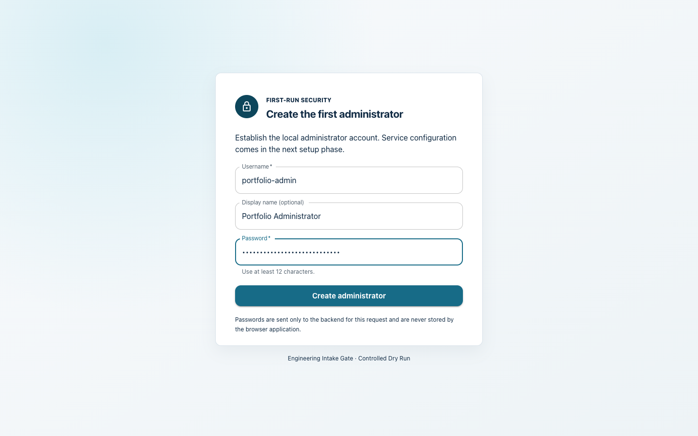

**Purpose:** establish the first local Administrator on a fresh installation, then provide normal local sign-in.

**Key controls:** username, optional display name, password, Bootstrap Admin, and Sign in.

**Typical workflow:** the first operator creates the single bootstrap Admin. Bootstrap closes transactionally as soon as a user exists; later visits use Login.

**Safety:** passwords are hashed with ASP.NET Core's adaptive hasher, never returned, and all authentication mutations require CSRF protection. There is no password-recovery workflow in this release.

## First-run setup

### Azure DevOps

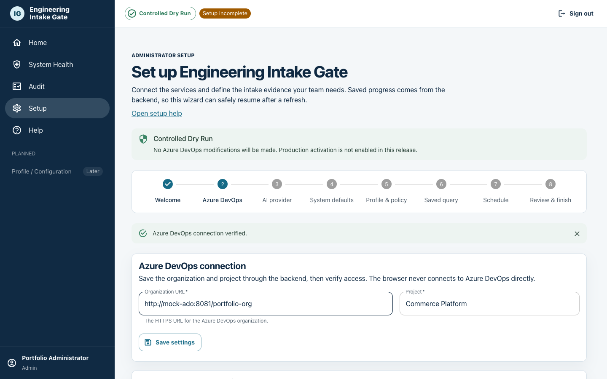

**Purpose:** establish the organization/project boundary and a read-only credential.

**Key controls:** Organization URL, Project, local encrypted PAT or environment reference, Save settings, Save credential, and Test connection.

**Typical workflow:** save the synthetic organization/project, store a least-privilege PAT, and verify access before continuing.

**Safety:** the PAT is sent only to the backend, is replaceable but never redisplayed, and requires only Work Items: Read in this Controlled Dry Run release.

### AI provider and model

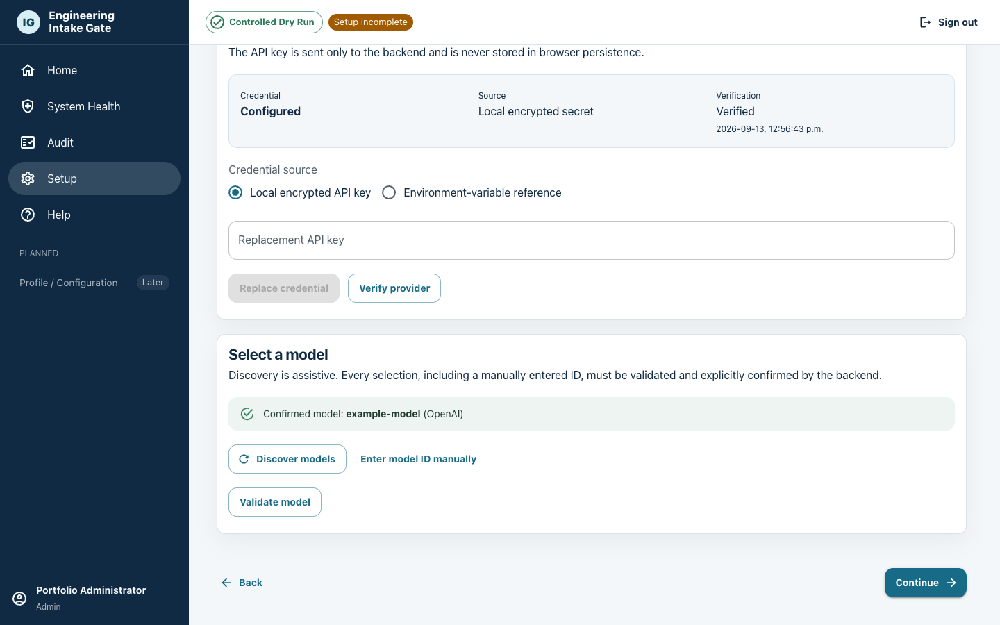

**Purpose:** select OpenAI or Anthropic, verify credentials, and bind a validated model.

**Key controls:** provider choice, local/environment credential source, Verify, Discover models, model selector, manual model-ID fallback, Validate, and Confirm.

**Typical workflow:** save and verify one provider credential, discover or enter a model, then explicitly confirm the revision-bound candidate.

**Safety:** credentials never reach browser persistence or reappear after submission. Provider responses are normalized server-side; discovery outages do not erase an already confirmed model.

### Profile and intake policy

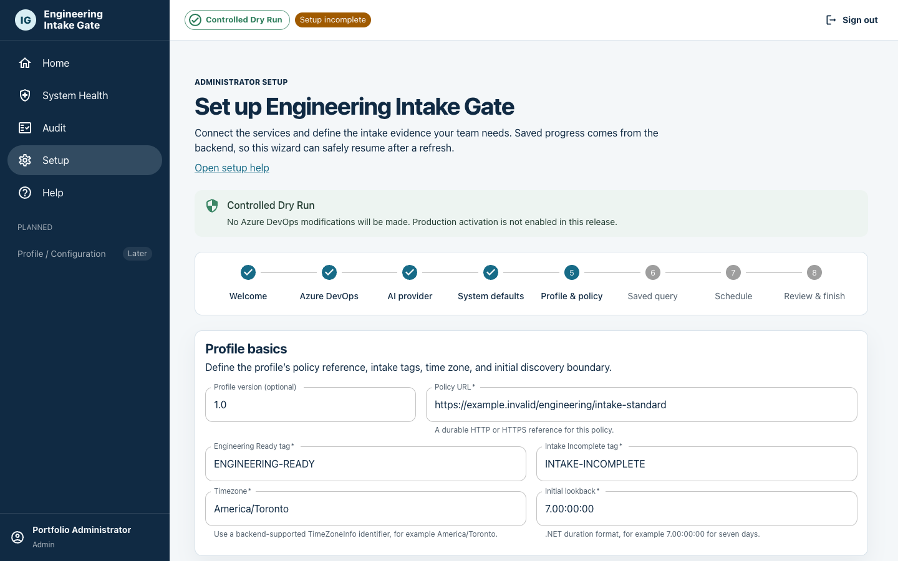

**Purpose:** define what evidence Engineering needs to begin investigation.

**Key controls:** policy URL/version, Engineering Ready and Intake Incomplete tags, criteria, applicability/N/A rules, guidance, processing limits, retries, concurrency, AI timeout, exclusions, and retention.

Use **Export Profile** to download the current Profile & Policy settings as a portable, secret-free JSON file. Use **Import Profile** to select a previously exported file, review the replacement warning, and confirm a full replacement. Imports never merge fields. Incomplete profiles are accepted into the persisted draft and the normal validation summary identifies what remains required.

The portable envelope is versioned (`format: engineering-intake-gate-profile`, `version: 1`) and contains separate `profile` and `policy` objects plus an ISO-8601 `exportedAt` timestamp. Credentials, API keys, generated profile IDs, runtime state, history, caches, and machine-specific data are not exported.

**Typical workflow:** initialize server defaults, supply organization-neutral criteria, tune bounded evidence/attachment limits, and save the revisioned draft.

**Safety:** execution mode is fixed to Dry Run. Criteria evaluate intake sufficiency only and cannot redefine defect truth, ownership, severity, priority, or commitment.

### Saved-query preview

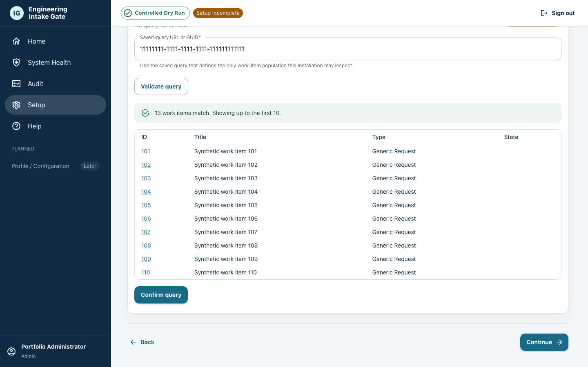

**Purpose:** confirm exactly which Azure DevOps population the gate governs.

**Key controls:** query GUID or matching URL, Validate query, bounded first-10 preview, and Confirm query.

**Typical workflow:** enter the saved query, inspect its total count and sample, then confirm the server-validated candidate.

**Safety:** arbitrary WIQL and cross-organization/project URLs are rejected. Confirmation safely rebaselines discovery/checkpoint state before the next generation activates.

### Review and finish

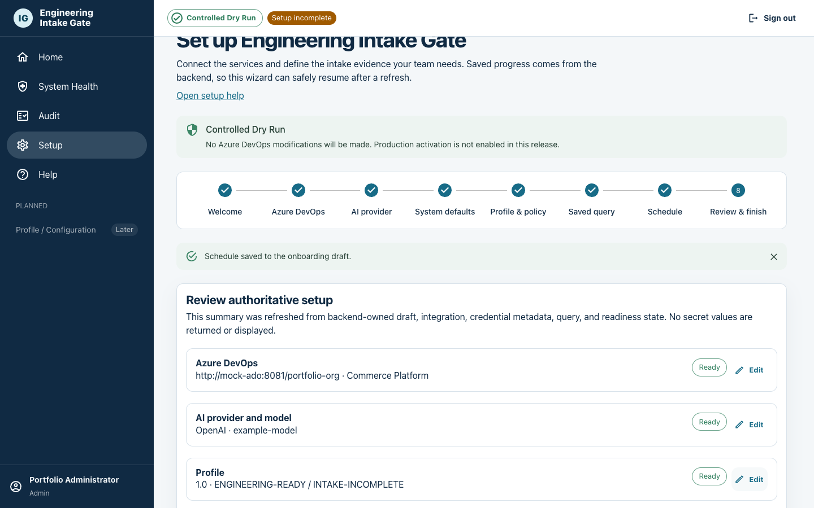

**Purpose:** verify that credentials, model, policy, saved query, and schedule are ready before creating the singleton profile.

**Key controls:** readiness rows, links back to each setup area, and Finish setup.

**Typical workflow:** resolve any Needs attention row, review the Controlled Dry Run warning, and finalize.

**Safety:** the backend atomically consumes the revisioned draft and confirmed staging state, creates one profile, and activates one immutable generation. Refresh/restart cannot invent or skip readiness.

## Home

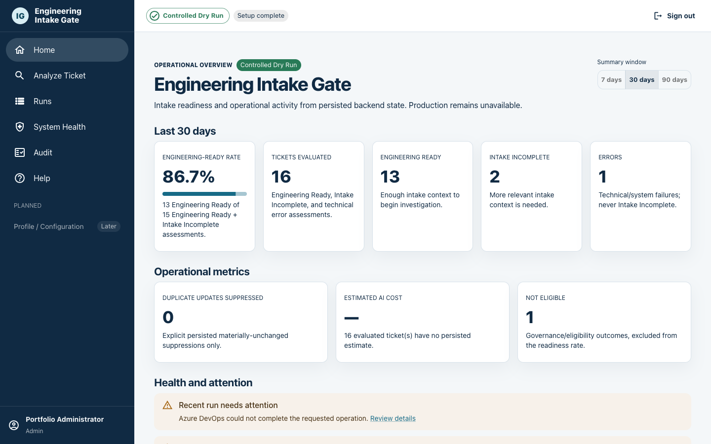

**Purpose:** provide a bounded operational summary for the last 7, 30, or 90 days.

**Key controls:** time-window selector, recent-run links, System Health links, Analyze Ticket, and Run Profile Now navigation.

**Typical workflow:** scan Engineering-Ready Rate, evaluated/ready/incomplete/error counts, Not Eligible, suppressed updates, estimated cost coverage, warnings, and recent activity.

**Safety:** the readiness rate is exactly PASS/(PASS+FAIL). Error and Not Eligible never enter the denominator. Opening Home reads persisted state and never tests a provider.

## Analyze Ticket

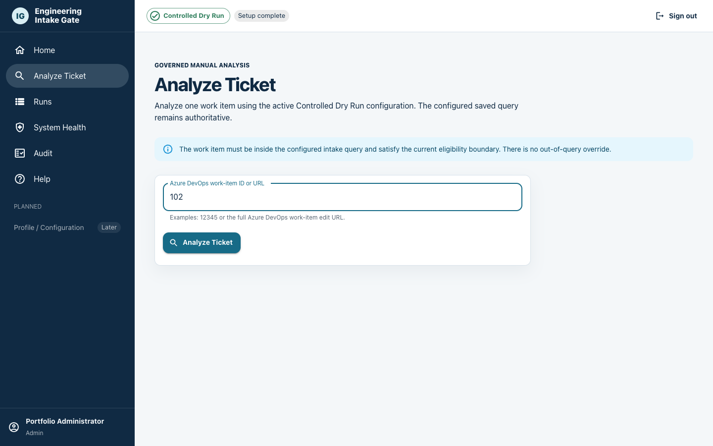

**Purpose:** run one governed assessment on demand.

**Key controls:** positive Azure DevOps work-item ID or supported full URL and Analyze Ticket.

**Typical workflow:** an Admin enters an item identity and submits; an eligible item opens its persisted run, while an out-of-boundary item returns Not Eligible.

**Safety:** the configured saved query and exclusions are rechecked. There is no query, mode, or out-of-query override, and no Azure DevOps mutation in Controlled Dry Run.

## Runs

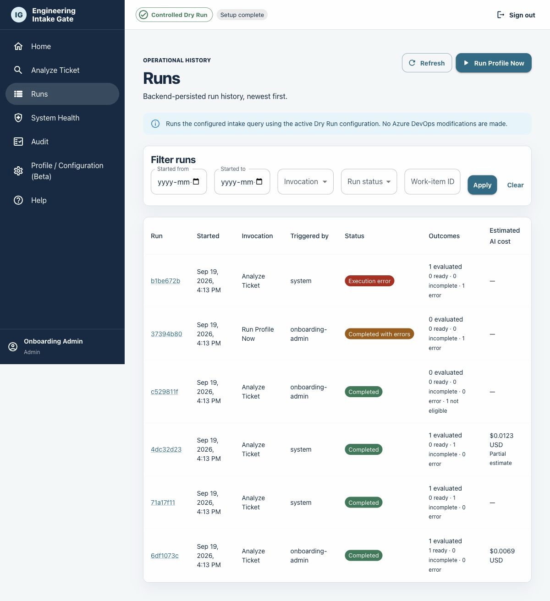

**Purpose:** browse execution history and trigger the singleton profile on demand.

**Key controls:** date/invocation/status/work-item filters, paging, Refresh, run links, and Admin-only Run Profile Now.

**Typical workflow:** filter persisted history, start a governed run when needed, and open a run for ticket-level detail.

**Safety:** history is server-paged and bounded. Run Profile Now uses the same SQLite lease and saved-query path as scheduling; no second run is queued while one is active.

## Run detail

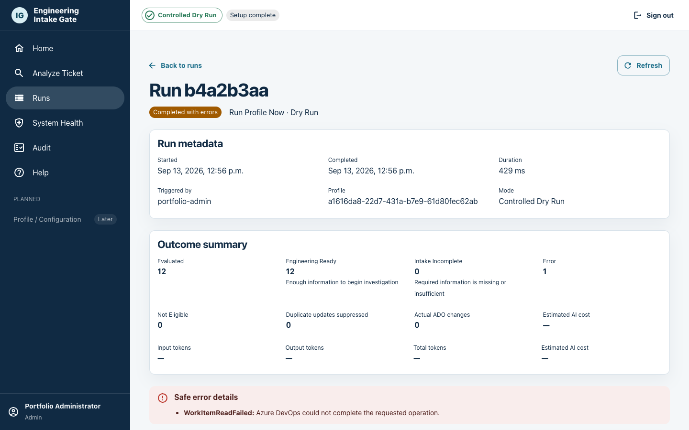

**Purpose:** explain one execution and summarize its ticket outcomes.

**Key controls:** evaluation links and progressive disclosure for configuration-generation metadata.

**Typical workflow:** review invocation, actor, timing, status, totals, usage/cost, then drill into a ticket.

**Safety:** the screen exposes safe projections only—never raw evidence, provider payloads, credentials, or a serialized configuration snapshot.

## Evaluation detail

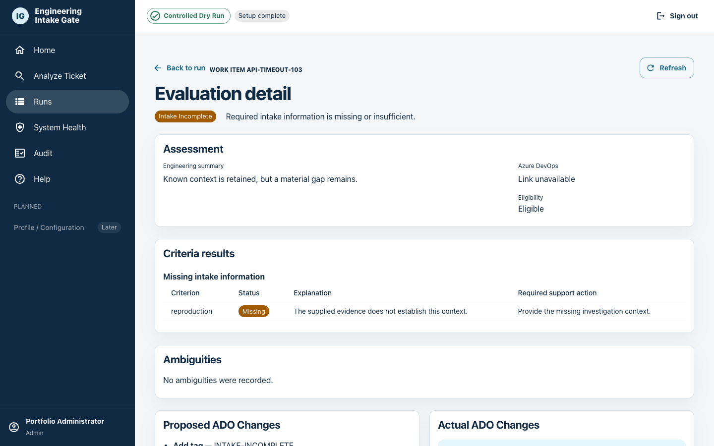

**Purpose:** make a single intake assessment explainable.

**Key controls:** outcome summary, criterion classifications, deficiencies, ambiguities, proposed effects, actual effects, token usage, estimated cost, and safe Azure DevOps link.

**Typical workflow:** understand why an item is Engineering Ready, Intake Incomplete, Error, or Not Eligible and which support action would improve it.

**Safety:** proposed and actual effects are always distinct. In Controlled Dry Run, proposals may exist while actual effects remain empty. Engineering Ready carries intake-only semantics.

## System Health

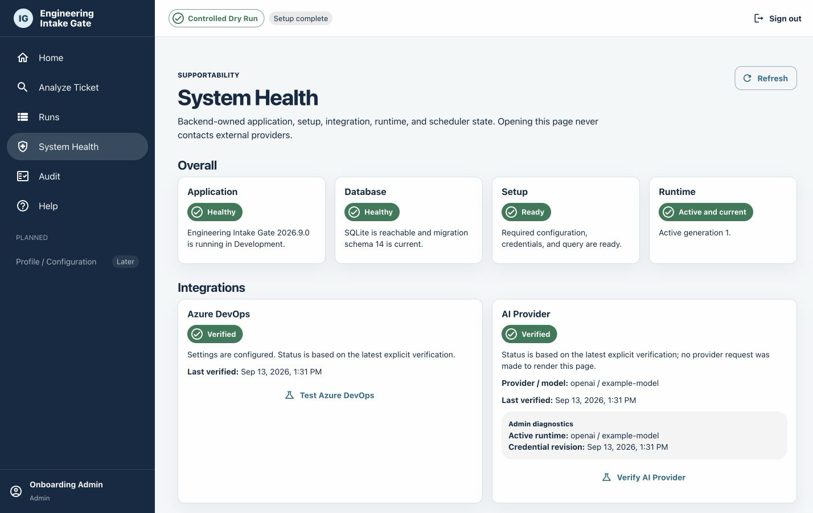

**Purpose:** separate application/database health, setup readiness, runtime activation, scheduler state, and persisted integration verification.

**Key controls:** Refresh plus Admin-only Test Azure DevOps and Verify AI Provider actions.

**Typical workflow:** diagnose authentication, configuration, scheduler, or recent run failures without treating an external outage as an application/database outage.

**Safety:** loading the page never contacts providers. Only explicit Admin actions do so, and Viewer responses omit Admin AI diagnostics.

## Audit

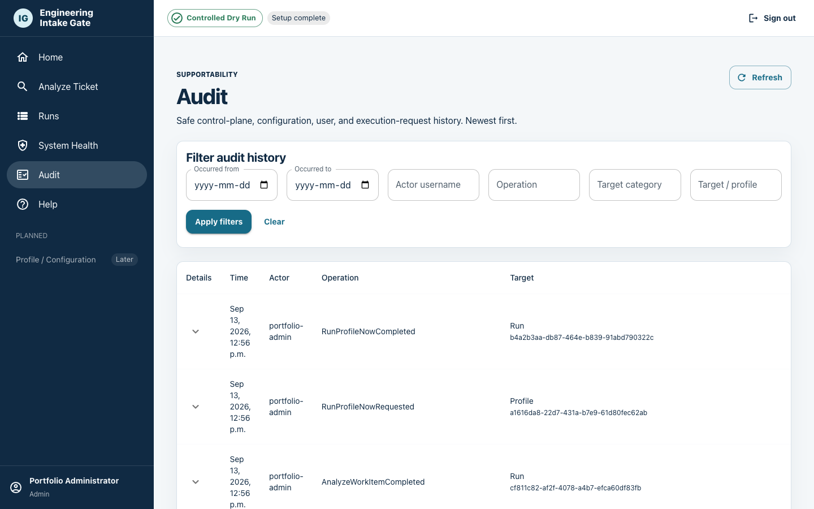

**Purpose:** review who changed configuration, credentials, users, or requested execution.

**Key controls:** date, actor, operation, category, and target filters; paging; and expandable safe event metadata.

**Typical workflow:** filter to an operational question, identify the actor and operation, and inspect the bounded changed-field list.

**Safety:** Audit is read-only and provides no undo path. It stores no passwords, credential values, ciphertext, evidence, provider bodies, cookies, or antiforgery tokens.
